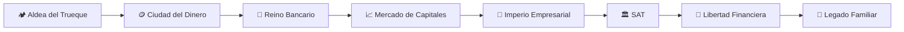

# 🏦⚔️ Finanzas RPG
## El Camino hacia la Libertad Financiera

> "La riqueza no comienza en tu cartera. Comienza en tu mente."

---

# 🎮 Bienvenido, Aventurero

Has despertado en **Finanzia**, un mundo donde cada decisión económica cambia tu destino.

No comienzas con una fortuna.

No tienes inversiones.

No conoces impuestos.

No sabes cómo funciona el dinero.

Empiezas exactamente como millones de personas...

**Con cero conocimiento financiero.**

Tu misión será convertirte en un **Arquitecto del Patrimonio**, capaz de crear riqueza de manera ética, sostenible y generacional.

---

# 📖 ¿Qué es Finanzas RPG?

No es un libro tradicional.

No es un curso universitario.

No es un libro de autoayuda.

Es una combinación de:

- 🎮 RPG
- 📚 Curso Universitario
- 🎥 Documental
- 📖 Novela
- 💼 Simulador Empresarial
- 💰 Manual de Inversión

Cada nivel te hará más fuerte financieramente.

---

# 🗺️ El Mundo de Finanzia

---

# 👤 Tu Compañero de Viaje

Durante toda la aventura conocerás a **Pedro**.

Pedro comienza exactamente igual que tú.

- Sin ahorros
- Sin inversiones
- Sin conocimientos
- Sin patrimonio

A lo largo del curso aprenderás observando cada una de sus decisiones.

Algunas serán inteligentes.

Otras serán errores.

Tú decidirás qué camino seguir.

---

# 🎯 Sistema de Progreso

Cada nivel contiene:

✅ Historia

✅ Explicación sencilla

✅ Explicación profesional

✅ Analogías

✅ Casos reales

✅ Curiosidades

✅ Ejercicios

✅ Mini examen

✅ Proyecto

✅ Misiones

✅ Logros

✅ Errores comunes

---

# ⭐ Experiencia (XP)

Cada vez que completes un nivel obtendrás experiencia.

| Acción | XP |
|---------|----|
| Leer un capítulo | +50 |
| Resolver ejercicios | +100 |
| Aprobar examen | +150 |
| Completar proyecto | +250 |
| Enseñar a otra persona | +500 |

---

# 🏆 Rangos

| Nivel | Rango |
|--------|--------|
| 0 | Despertar |
| 1 | Aprendiz |
| 2 | Explorador |
| 3 | Estratega |
| 4 | Inversionista |
| 5 | Empresario |
| 6 | Arquitecto Financiero |
| 7 | Maestro del Patrimonio |
| 8 | Constructor de Legados |

---

# 📚 Índice Maestro

## Prólogo

- Cómo aprovechar este curso
- Reglas del juego
- Cómo aprender más rápido

---

# Nivel 0

## 🪙 El Origen del Dinero

- El trueque
- Primeras monedas
- Oro
- Plata
- Bancos
- Crédito
- Inflación
- Patrón oro
- Dinero fiduciario
- Bitcoin
- Monedas digitales

---

# Nivel 1

## 💵 Cómo Funciona el Dinero

- Qué es realmente
- Valor
- Oferta monetaria
- Bancos Centrales
- Creación de dinero

---

# Nivel 2

## 🌍 Economía

- PIB
- Inflación
- Oferta
- Demanda
- Tasas
- Recesiones
- Empleo

---

# Nivel 3

## 🏦 Sistema Bancario

- Bancos
- Tarjetas
- Créditos
- Hipotecas
- Buró
- CETES
- Banco de México

---

# Nivel 4

## 💰 Finanzas Personales

- Presupuesto
- Ahorro
- Deudas
- Patrimonio
- Seguros
- Fondo de emergencia

---

# Nivel 5

## 📈 Inversiones

- Riesgo
- Rendimiento
- Acciones
- ETFs
- CETES
- Bonos
- FIBRAs
- Oro
- Plata
- Criptomonedas

---

# Nivel 6

## 🏢 Empresas

- Modelos de negocio
- Flujo de caja
- EBITDA
- Escalabilidad
- Valuación

---

# Nivel 7

## 📊 Contabilidad

- Balance General
- Estado de Resultados
- Flujo de Efectivo
- Depreciación
- Amortización

---

# Nivel 8

## 🏛 SAT e Impuestos

- RFC
- e.firma
- ISR
- IVA
- RESICO
- Facturación
- Deducciones
- Personas Físicas
- Personas Morales

---

# Nivel 9

## 🚀 Emprendimiento

- Validar ideas
- MVP
- Marketing
- Ventas
- IA
- Automatización

---

# Nivel 10

## 💎 Libertad Financiera

- FIRE
- Ingresos pasivos
- Diversificación
- Retiro

---

# Nivel 11

## 👑 Patrimonio Generacional

- Testamentos
- Fideicomisos
- Empresas familiares
- Planeación patrimonial

---

# 🎒 Inventario Financiero

Durante el curso irás desbloqueando herramientas.

- 📒 Presupuesto Maestro
- 📈 Calculadora de Interés Compuesto
- 📊 Plantilla de Flujo de Caja
- 🧾 Plantilla de Impuestos
- 💼 Simulador de Inversiones
- 🏢 Simulador Empresarial

---

# 📜 Reglas del Aventurero

- Comprende antes de invertir.
- Nunca inviertas en algo que no entiendas.
- La deuda puede ser una herramienta o una prisión.
- El patrimonio se construye durante décadas.
- La riqueza sostenible nace del conocimiento y la disciplina.
- Aprende, aplica, comparte y mejora continuamente.

---

# ✅ Progreso del Jugador

- [ ] Prólogo
- [ ] Nivel 0
- [ ] Nivel 1
- [ ] Nivel 2
- [ ] Nivel 3
- [ ] Nivel 4
- [ ] Nivel 5
- [ ] Nivel 6
- [ ] Nivel 7
- [ ] Nivel 8
- [ ] Nivel 9
- [ ] Nivel 10
- [ ] Nivel 11

---

# 🌟 Objetivo Final

No se trata de ser millonario.

Se trata de que el dinero trabaje para ti, de vivir con libertad y de construir un legado que beneficie a las siguientes generaciones.

---

## 🎉 ¡Que comience la aventura!

**La misión principal ha sido aceptada.**
